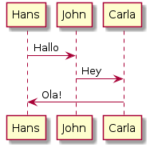

PlantUML Server 
===============
**Master Status**: 
[](https://travis-ci.org/rado0x54/plantuml-server)

PlantUML Server is a web application to generate UML diagrams on-the-fly.


 
To know more about PlantUML, please visit http://plantuml.sourceforge.net/.

Requirements
============

 * jre/jdk 1.8.0 or above

How to run the server
=====================

Just run:

```
gradle appRun
```

The server is now listing to [http://localhost:8080/](http://localhost:8080/).
In this way the server is run on an embedded jetty (or tomcat) server. 


How to run the server with Docker
=================================

```
docker build -t plantuml .
docker run -d -p 8080:8080 plantuml
```

The server is now listing to [http://localhost:8080](http://localhost:8080).

You may specity the port in `-p` Docker command line argument.


How to generate the war
=======================

To build the war, just run:

```
gradle war
```

at the root directory of the project to produce plantuml.war in the `build/libs/` directory.


Fork Information
=======================

### URL Encoded PlantUML

I started this fork to support image generation for url-encoded PlantUML Syntax
in order to be able to integrate it dynamically into
[GFM Files](https://help.github.com/articles/about-writing-and-formatting-on-github/).

This enables the usage of the following syntax:

    
    
to automically generate the following image *on the fly*.



You can add the typical @startuml and @enduml but it's not needed as that's the default. Sample:

    

Of course you need some online instance providing this service. Replace `http://localhost:8080/plantuml` accordingly and your should be good to go.

### Other
 - Migrated from `mvn` to `gradle`.
 - Fixed all Tests (that were failing in the original project).
 - General Dependency Update
 - Updated `Dockerfile` to use `jetty:latest` and added `Graphviz` and `HEALTHCHECK`
 - Integrated [Travis-CI](https://travis-ci.org/rado0x54/plantuml-server)
 - Automatically provide Docker Image of `master` on [DockerHub](https://hub.docker.com/r/rado0x54/plantuml)
